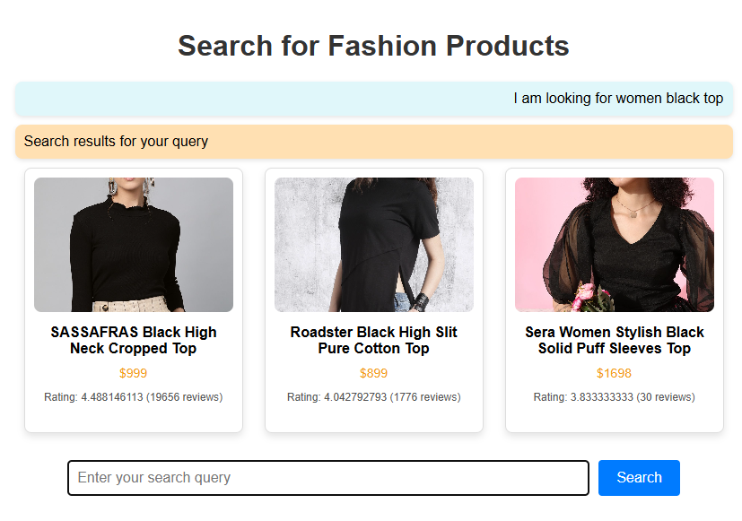
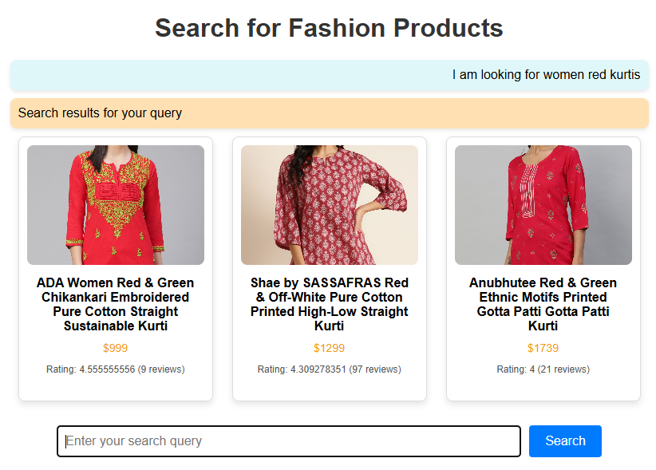
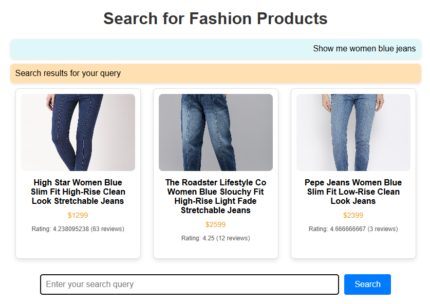

<div align = "center">


# 🤖 **Trend Setters - E-Commerce Conversational Chatbot**

*Product submitted to Cognizant Kolkata through Digital Nurture TechnoVerse East Hackathon*

[](https://www.python.org/downloads/)
[](https://pytorch.org/)
[](LICENSE)
[](https://fastapi.tiangolo.com)
[](https://github.com/psf/black)

[Features](#-features) • [Installation](#-installation) • [Tech Stack](#-tech-stack) • [Usage](#-usage) • [Future Enhancements](#-future-enhancements)

</div>

# 📌 Overview

## 📝 Project Overview

This project is an **AI-powered conversational chatbot** built for **e-commerce platforms**.  
It enables users to discover and explore fashion products through natural conversations instead of traditional keyword searches.  
By combining **Natural Language Processing (NLP)** with **Vector Search (Qdrant)**, the chatbot delivers highly relevant and personalized product recommendations.  
The system is designed with a **Flask backend**, an **interactive frontend UI**, and integrates **state-of-the-art LLaMA models** (via Groq API and Hugging Face) for intelligent query understanding and recommendation.  

---

# 🚀 Features

* **Conversational AI Assistant**: Powered by **LLaMA 3 (70B)** via Groq API for natural and human-like conversations.  
* **Intelligent Vector Search**: Leverages **Qdrant Vector Database** to find the most relevant fashion products using semantic similarity.  
* **Multi-Attribute Query Handling**: Supports dynamic filtering based on **brand, color, category, gender, size**, and more.  
* **Context-Aware Query Processing**: Understands partial queries and prompts users for missing details to refine results.  
* **Fallback Recommendation System**: Displays **10 random trending products** when no attributes are provided, ensuring the user always sees results.  
* **Optimized Model Performance**: Supports **4-bit Quantization (Linux/CUDA)** and **8-bit LoRA (Windows)** for faster, resource-efficient inference.  
* **Scalable Architecture**: Easily extendable to integrate new product categories, recommendation strategies, or external APIs.  

---

# 🛠️ Tech Stack

* **Frontend**: [HTML](https://developer.mozilla.org/docs/Web/HTML), [CSS](https://developer.mozilla.org/docs/Web/CSS), [JavaScript](https://developer.mozilla.org/docs/Web/JavaScript)  
* **Backend**: [Flask](https://flask.palletsprojects.com/), [Python](https://www.python.org/)  
* **Vector Database**: [Qdrant](https://qdrant.tech/)  
* **Groq LLM Model**: [Groq API](https://groq.com/) using **llama-3.3-70b-versatile** (powered by META)  
* **Hugging Face LLM Model**: [Hugging Face](https://huggingface.co/meta-llama) **Llama-3.1-8B** (powered by META)  
* **Fine-Tuning**: [4-bit Quantization](https://huggingface.co/docs/transformers/main_classes/quantization) for CUDA/Linux & [LoRA](https://huggingface.co/docs/peft/main/en/conceptual_guides/lora) (8-bit) for Windows  
* **Deployment**: *TBD*

---

## 📚 Dataset - Fashion E-Commerce Data Set

📎 **Source**: Custom-curated dataset integrated with [Qdrant Vector Database](https://qdrant.tech/)

The **Fashion E-Commerce Data Set** is a structured product dataset containing detailed information about fashion items.  
It is used to power semantic search and AI-driven product recommendations in this project.  

#### 📁 Dataset Highlights:

* **Total Records**: ~3,000 fashion products (expandable)  
* **Type**: Tabular (Structured)  
* **Task**: Product Recommendation & Attribute-based Retrieval  

#### ✅ Why This Dataset?

* Contains **rich product attributes** (brand, color, size, category, gender, ratings).  
* Enables **multi-attribute filtering** through natural conversations.  
* Optimized for **semantic similarity search** with vector embeddings.  
* Suitable for building **personalized recommendation systems** in e-commerce.  

---

# 🔧 Installation

1. **Clone the repository**

   ```sh
   git clone git@github.com:priyam-hub/Trend-Setters.git
   cd Trend-Setters
   ```

2. **Create Conda Environment and Install Dependencies**

   ```sh

   # CONDA ENV CREATED ALONG WITH DEPENDENCY INSTALLED
   conda env create -f environment.yml
   
   # ACTIVATE CONDA ENVIRONMENT
   conda activate <env_name>
   ```

3. **Set up environment variables**
   * Create a `.env` file in the root directory of the Project and add the following Credentials:

   ```env
   GROQ_API_KEY              = "YOUR_GROQ_API_KEY"
   LLM_MODEL_NAME            = "YOUR_LLM_MODEL_NAME"
   HF_LLM_MODEL_NAME         = "YOUR_HF_LLM_MODEL_NAME"
   QDRANT_API_KEY            = "YOUR_QDRANT_API_KEY"
   QDRANT_CLUSTER_URL        = "YOUR_QDRANT_CLUSTER_URL"
   QDRANT_COLLECTION_NAME    = "YOUR_QDRANT_COLLECTION_NAME"
   HUGGINGFACE_LOGIN_TOKEN   = "YOUR_HUGGINGFACE_LOGIN_TOKEN"
   ```

4. **Run the Flask server**

   ```sh
   python web/app.py
   ```

5. **Access the E-Commerce Platform**
   Open `http://127.0.0.1:5000` in your browser.

---

## 🔍 Usage

1. **Enter a Query**: Type a product-related query (e.g., *"Show me blue Adidas shoes"*).  
2. **NLP Processing**: The chatbot extracts attributes like brand, color, and category from your query.  
3. **Smart Filtering**:  
   * If attributes are provided → Relevant products are displayed.  
   * If attributes are missing → It suggests similar items and prompts for more details.  
4. **Fallback Search**: If no attributes are found, 10 random products are shown with a prompt to refine the search.  

### 📸 Example Search Results  

| Query | Result |
|-------|--------|
| *"I am Looking for women Black Top"* |  |
| *"I am Looking for Women Red Kurtis"* |  |
| *"Show me women blue jeans"* |  |

---

# 📂 Project Structure

```plaintext
Trend-Setters/
├── .env                                     # Optional environment variables for API keys, database URLs, and other secrets
├── .gitignore                               # Git ignore rules to exclude unnecessary files from version control
├── environment.yml                          # Conda environment configuration with all dependencies
├── LICENSE                                  # MIT License for project usage and distribution
├── main.py                                  # Main script to run the application (entry point)
├── README.md                                # Project documentation and overview
├── requirements.txt                         # Python package dependencies for pip installation
├── config/
│   ├── __init__.py                          # Marks config as a Python package
│   └── config.py                            # Configuration settings for API keys, model paths, and constants
├── data/
│   └── V-1.01_Updated_Fashion_Dataset.csv   # Fashion dataset containing product attributes
├── images/
│   ├── image.png                            # General images used in README or UI
│   ├── search_result_1.png                  # Example screenshot of search result 1
│   ├── search_result_2.png                  # Example screenshot of search result 2
│   └── search_result_3.png                  # Example screenshot of search result 3
├── logger/
│   ├── __init__.py                          # Marks logger as a Python package
│   └── logger.py                            # Custom logging utility for tracking events and errors
├── models/
│   └── meta-llama/Llama-3.1-8B/             # Pretrained Hugging Face LLaMA 3.1 8B model
│       ├── model/                           # Model weights and architecture
│       └── tokenizer/                       # Tokenizer files for text processing
├── notebooks/
│   └── Trend-Setters.ipynb                  # Jupyter notebook for experiments, analysis, and prototyping
├── src/
│   ├── extractor/  
│   │   ├── __init__.py                      # Marks extractor as a Python package
│   │   └── extractor.py                     # Extracts product attributes from user queries
│   ├── llm/
│   │   ├── __init__.py                      # Marks LLM module as a package
│   │   └── llm_builder.py                   # Loads and configures LLM models (Groq & Hugging Face)
│   ├── parser/   
│   │   ├── __init__.py                      # Marks parser as a Python package
│   │   └── parser.py                        # Parses extracted attributes into search-friendly format
│   └── searcher/
│       ├── __init__.py                      # Marks searcher as a Python package
│       └── extractor.py                     # Performs vector search on Qdrant and retrieves products
├── test/
│   ├── __init__.py                          # Marks test folder as a Python package
│   └── test.py                              # Unit tests for different modules
└── web/
    ├── static/
    │   ├── css/
    │   │   ├── styles_home.css              # CSS for homepage
    │   │   └── styles.css                   # General styling for web pages
    │   ├── images/
    │   │   ├── icon/                        # Icons used in the UI
    │   │   ├── logo/                        # Logo images
    │   │   └── products/                    # Product images for frontend display
    │   └── js/
    │       ├── home.js                      # JS for homepage functionalities and search
    │       └── chatBot.js                   # JS for chatbot interactions and modal/chat window
    ├── templates/
    │   ├── index_home.html                  # Homepage template
    │   └── index.html                       # Main index page template
    ├── __init__.py                          # Marks web folder as a Python package
    └── app.py                               # Flask application file to run backend and route endpoints
```
---

# 📜 License

This project is licensed under the [MIT License](./LICENSE).

---

# 🔮 Future Enhancements

### 🚀 Phase 1 – Core Improvements
- **User Authentication**: Enable login/logout with saved chat history.  
- **Better Query Understanding**: Improve NLP pipeline for more accurate attribute extraction.  
- **UI/UX Enhancements**: Add responsive chatbot widget with modern design.  
- **Randomized Recommendations**: Smarter fallback mechanism with trending products instead of purely random ones.  

### 🌍 Phase 2 – Advanced Features
- **Multi-Language Support**: Let users interact in multiple languages.  
- **Voice Search**: Integrate speech-to-text for hands-free chatbot queries.  
- **Recommendation Engine**: Personalized product suggestions using collaborative filtering.  
- **Image-Based Search**: Upload product images to get visually similar results.  

### ☁️ Phase 3 – Enterprise & Scalability
- **Real-Time Inventory Sync**: Connect with live e-commerce databases to track stock availability.  
- **Payment Integration**: Allow direct checkout and transactions within chatbot.  
- **Analytics Dashboard**: Provide admins with insights on queries, popular searches, and conversion rates.  
- **Cloud Deployment & Scaling**: Deploy with Docker/Kubernetes on AWS/GCP/Azure for high availability.  
- **Security Enhancements**: Implement JWT authentication, role-based access, and encrypted APIs.  


---

<div align="center">

**Made with ❤️ by Team Technocrats**

[↑ Back to Top](#)

</div>
